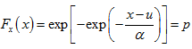

# Flood Frequency Analysis and Creating Functions {#floods}

## Template Repository

The following activity is available as a template github repository at the following link:


## Intro
This methods for this chapter are adapted from the following activity:
https://serc.carleton.edu/hydromodules/steps/166250.html

After working with Flow Duration Curves (FDCs) and performing a low flow analysis, we now understand all the concepts necessary to perform a floow frequency analysis. In this chapter we will perform a flood frequency analysis using a Gumbel extreme value distribution and then write our own function that will return the magnitude of whatever probability flood we want!

First we will load the tidyverse and dataRetrieval packages and the set the theme for our plots.

```{r, warning=FALSE, results='hide',message=FALSE}
library(tidyverse)
library(dataRetrieval)

theme_set(theme_classic())
```
Next, download the yearly peakflow data from USGS dataRetrieval using the readNWISpeak() function. We don't have to create our own yearly values like we did in the low flow analysis. This function just returns the highest flow for each year.

Download the data for the New River at Radford starting in 1945.

Then make a plot of the peak flow for each year.

```{r}

```

As with the couple previous chapters, the next step is to create a column that contains the ranks of each flow in the record. Create a column that has the rank of each flow, with the highest flow ranked #1. Use select() to trim your dataset to just the peak data, peak values, and ranks columns.

Make the plot from the last code chunk again but color the points by rank to check that this worked. 
Also, look at the data through the environment tab in rstudio or using head() to double check.

```{r}

```
Now we need to calculate the exceedance probability and return interval for each value in our data. For flood frequency analysis, it is common to use the Gringorten plotting position formula: 


qi = Exceedance probability

N = Number of observations in your record

i = Rank of specific observation, i = 1 is the largest, i = N is the smallest.

a = constant for estimation = 0.44

------------------------------------------------------------------------

$Non-exceedence probability = pi = 1 - qi$

------------------------------------------------------------------------

Return period

$Tp = 1/(1-p)$

In the chunk below, create a column in your dataset and calculate each: exceedance probability, non-exceedane probabily, and return period.

Then make a plot with peak flow on the Y axis and Return Period on the X.
```{r}


```

Now we need to fit these data to a distribution in order to make a relationship we can use to predict the discharge of specific return intervals.

There are many distributions that can be used in this situation, but a common one for flood frequency analyses is the Gumbel extreme value distribution:



x is observed discharge data, u and x are parameters that shape the distribution.

We can calculate u and x in order to create a distribution that best fits our data with the following equations. Notice **x bar** is mean and **sx2** is variance. We will need to find **sx**, which is the square root of the variance, also known as the standard deviation.

{width="248"}

In the chunk below, calculate u and alpha by first calculating xbar (mean) and sx (standard deviation) and then using them in the above equations for u and x.
```{r}

```

Now that we have the parameters that best represent our data as a Gumbel Distribution, we can use the formula to create the theoretical values for the return interval according to that distribution.

 

In the chunk below:

First calculate p theoretical with the equation above.

Then calculate Tp theoretical (the return period) as T was calculated above Tp = 1 / (1-p)

Finally create a plot of return period on the y axis and peak values on the x. Include return periods calculated from your data and those calculated from the Gumbel distribution on your plot as points of different colors.

```{r}

```

Let's look at these data a slightly different way to make it easier to see what is going on and how we can pull of flows for different return periods. 

Make the same plot as abote but show the theoretical values (from the distribution) as a line, with the estimated values as points, and log the x axis with limits set to 1 - 100.

With this plot you could look up the return period for any flood or the discharge level for any return period.

```{r}

```

This plot is showing a representation of the fitted distribution by calculating the return period for each point in our dataset. But we can also use it to calculated the specific flow that corresponds to any return period by using the established relationship.

In the chunk below, calculate the magnitude of a 1 in 100 chance, or 100 year flood using the following two formulas where p = exceedance probability and Tp = return period. These are just the equations used to calculate return period rearranged to calculate peak flow.

$p = Tp / (Tp - 1)$

$peakflow = u - (alpha - log(log(p)))$

According to this flow, what is the 1 in 100 chance flood at this location? Do you see any issues with reporting this as the 1 in 100 chance flood? What are they?

```{r}

```
This is a good opportunity to illustrate the usefulness of writing your own functions. When you install packages in R, you get a bunch of functions you can use. But you can also create these on your own to simplify your analyses!

You do this with the following syntax 
>MyNewFunction <- function(param1, param2){ 
>code 
>}

Whatever the last line of the "code" portion of the function spits out, get's returned from the function. So if you said X <- mynewfunction(param1, parm2) X would now have it in whatever your function returned. See a simple example below: a function that adds 1 to any number we pass to it.

```{r}

```


Let's create a function that returns the return period for a flood of any magnitude for the gage we are investigating. Creating functions is a great way to streamline your workflow. You can write a function that performs an operation you need to perform a bunch of times, then just use the function rather than re-writing/copying the code.

Our function will be called "ReturnPeriod" and we will pass it the flow we want the return period for, and the u and alpha of the distribution.

We will test the function by having it calculate the return period for the 100 year flood we calculated earlier (120027). If it works, it should spit out 100.
```{r}

```

## Challenge: Create a function

Create a function that returns the 100 year flood when given a USGS gage id, startdate, and enddate for the period you want to investigate.

```{r}

```
